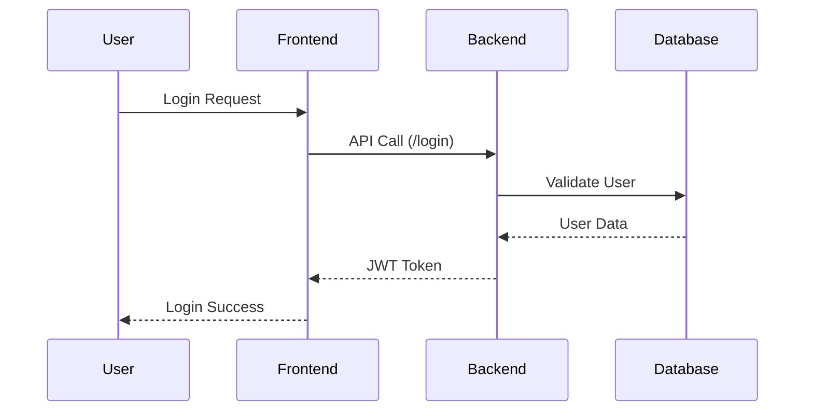

# Springboot application layers
1. Controller layer
2. Service layer
3. Repository/DAO layer

# Project Folder structure
```
E-commerce
└── src/main/java
    ├── com.nt.controller
    │   ├── UserController.java
    │   └── ProductController.java
    ├── com.nt.service
    │   ├── UserService.java
    │   └── ProductService.java
    └── com.nt.repository
        ├── UserRepository.java
        └── ProductRepository.java
```

# Project Flow Diagram

