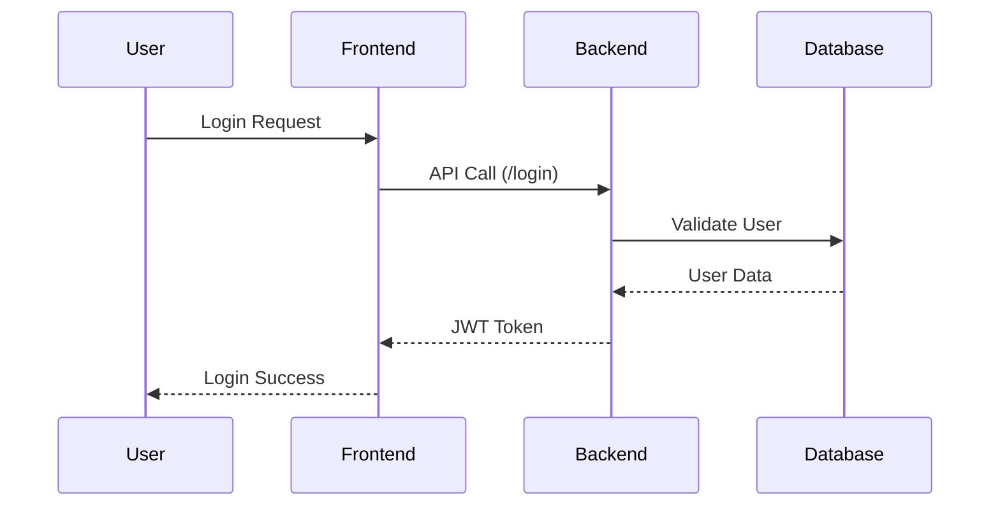

# Springboot application layers
1. Controller layer
2. Service layer
3. Repository/DAO layer

# Project Folder structure
```
E-commerce
└── src/main/java
    ├── com.nt.controller
    │   ├── UserController.java
    │   └── ProductController.java
    ├── com.nt.service
    │   ├── UserService.java
    │   └── ProductService.java
    └── com.nt.repository
        ├── UserRepository.java
        └── ProductRepository.java
```
# Code
```java
public class Main {
  public static void main(String args[]){
    System.out.println("Welcome to the world of Java...");
  }
}
```
# Tables

| Sr. | Country | Capital |
|-----|---------|---------|
| 1   | India   | Delhi   |
| 2   | USA     | Washington |
| 3   | Russia  | Moscow |
| 4   | China   | Beijing |

# Project Flow Diagram

# New Project Structure
```
test/
├── controller/
│   └── EmployeeController.java
├── Git and GitHub.txt
├── HelloWorld.java
├── index.html
├── README.md
├── Springboot.txt
├── Test.txt
├── Test1.txt
└── Welcome.java
```


