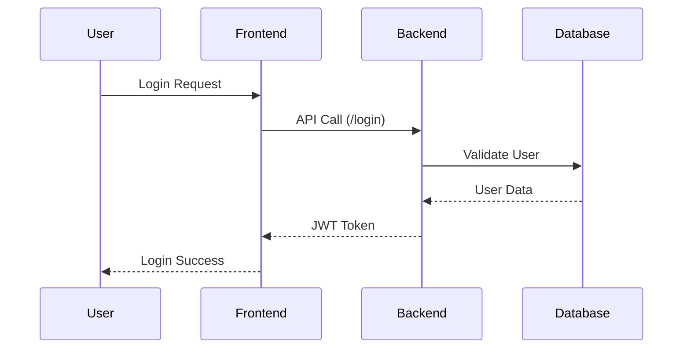

```mermaid
sequenceDiagram
    participant User
    participant Frontend
    participant Backend
    participant Database

    User->>Frontend: Login Request
    Frontend->>Backend: API Call (/login)
    Backend->>Database: Validate User
    Database-->>Backend: User Data
    Backend-->>Frontend: JWT Token
    Frontend-->>User: Login Success
```
